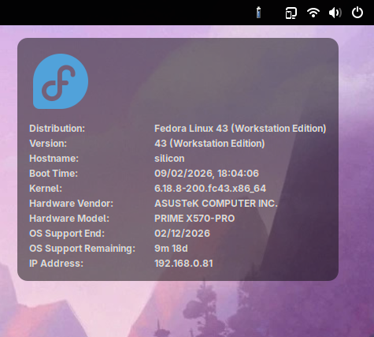

# Wallpaper Information

A GNOME Shell extension that displays system information overlaid on your desktop wallpaper.



## Description

This extension displays system information as a transparent overlay on the desktop of the primary monitor. It shows useful system information including:

- Linux distribution name and version (via `hostname1` or `/etc/os-release`)
- Distribution logo (automatically detected)
- Hostname
- Last Boot Time
- IP address(es)
- Kernel version
- Hardware Vendor, Model, and Firmware Version
- OS Support End date and remaining time
- Chassis asset tag and System serial number (from DMI/DBus)
- Company logo (optional)

The information is displayed in a customizable semi-transparent box and updates intelligently:
- Network information updates automatically when network state changes (via DBus)
- Other information updates every 30 seconds

## Features

- **Fully configurable**: Comprehensive preferences UI using modern GNOME components
- **OS information**: Displays Linux distribution name, version, and logo
- **Distribution logo**: Automatically detects and displays your distro's logo with customizable alignment and border radius
- **Flexible positioning**: Choose from 9 positions (top/middle/bottom × left/center/right)
- **Customizable appearance**: Native font and color selection dialogs, background color, border radius, and padding
- **Aligned layout**: Uses a grid-like layout where labels are aligned and values can span multiple lines
- **Toggle information items**: Show or hide any information item individually
- **Company logo support**: Display a custom logo image with configurable size, alignment, and border radius
- **Event-driven network updates**: Network information updates automatically via NetworkManager DBus signals
- **Boot time display**: Shows when the system was last booted
- **Container-based architecture**: Each information item is in its own container for better flexibility
- **Real-time updates**: Settings changes apply immediately without restart
- **No external dependencies**: Uses native Linux APIs and GNOME Shell APIs (DBus, GIO, etc.)
- **Modern GNOME support**: Compatible with GNOME Shell 45, 46, 47, 48, and 49

## Requirements

- GNOME Shell 45 or newer (tested up to GNOME 49)
- No external dependencies required!

## Installation

1. Clone this repository to your GNOME Shell extensions directory:

```bash
cd ~/.local/share/gnome-shell/extensions/
git clone <repository-url> wallpaper_information@thegoldfish.org
```

2. Restart GNOME Shell:
   - On X11: Press `Alt+F2`, type `r`, and press Enter
   - On Wayland: Log out and log back in

3. Enable the extension:

```bash
gnome-extensions enable wallpaper_information@thegoldfish.org
```

Or use GNOME Extensions app or GNOME Tweaks to enable it.

## Configuration

Access the extension preferences to customize the display:

```bash
gnome-extensions prefs wallpaper_information@thegoldfish.org
```

Or use GNOME Extensions app and click the settings icon for this extension.

### Position Settings

Choose where the information box appears on your screen:
- **Vertical Position**: Top, Middle, or Bottom
- **Horizontal Position**: Left, Center, or Right

This gives you 9 possible positions to place the information display.

### Information Items

Toggle which information to display:
- ✓ Distribution Name
- ✓ Distribution Version
- ✓ Hostname
- ✓ Boot Time
- ✓ Kernel Version
- ✓ Hardware Vendor
- ✓ Hardware Model
- ✓ Firmware Version
- ✓ OS Support End
- ✓ OS Support Remaining
- ✓ Asset Tag
- ✓ Serial Number
- ✓ IP Address

Each item can be individually enabled or disabled.

### Appearance Settings

Customize the look and feel:
- **Font**: Select font family and size using the native GNOME Font Dialog
- **Font Color**: Set text color using the native GNOME Color Dialog (supports transparency)
- **Background Color**: Set background color and transparency using the native GNOME Color Dialog
- **Border Radius**: Set corner roundness for the information box
- **Padding**: Set internal spacing for the information box

### Logos

#### Logo Settings
- **Show Logo**: Toggle logo display on or off (defaults to distribution logo)
- **Custom Logo**: Choose an image file (PNG, JPEG, or SVG) to override the distribution logo
- **Logo Size**: Set logo size from 16 to 256 pixels
- **Logo Border Radius**: Round the corners of the logo
- **Logo Alignment**: Align the logo to the Left, Center, or Right within the box

## How It Works

1. The extension creates a container-based layout using `St.BoxLayout` with styling from `stylesheet.css`.
2. It gathers system information primarily via the `org.freedesktop.hostname1` DBus interface (systemd-hostnamed).
3. If DBus is unavailable, it fallbacks to reading system files:
   - OS information from `/etc/os-release`
   - Distribution logo from icon theme or `/usr/share/pixmaps/`
   - Boot time from `/proc/uptime`
   - Kernel version from `/proc/version`
   - DMI information (Vendor, Model, Serial, Asset Tag) from `/sys/class/dmi/id/`
4. Network information (IP addresses) is retrieved from NetworkManager via DBus.
5. Labels are automatically aligned based on the longest visible label to create a clean, table-like layout.
6. The container is inserted into the background group layer (behind windows, but on top of wallpaper) and positioned according to user preferences.
7. Information is refreshed every 30 seconds, while network changes trigger immediate updates via DBus signals.

## Troubleshooting

### Extension not showing up
- Make sure the extension directory is named exactly `wallpaper_information@thegoldfish.org`
- Check that you have GNOME Shell 45 or newer
- Look for errors in the GNOME Shell log: `journalctl --user -f -u org.gnome.Shell.desktop`

### No output displayed
- Check for JavaScript errors: `journalctl --user -f -u org.gnome.Shell.desktop -o cat | grep wallpaper`
- Verify that at least one information item is enabled in preferences

### Settings not saving
- Make sure the `schemas` directory contains the compiled GSettings schema
- Recompile the schema if needed: `glib-compile-schemas schemas/`

### Wrong position or styling
- Use the preferences UI to adjust position and appearance settings
- Changes apply in real-time without needing to reload the extension

## License

Copyright (C) 2019-2026 Tim Hughes <thughes@thegoldfish.org>

Distributed under terms of the MIT license.
