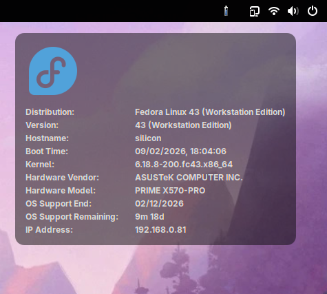

# Wallpaper Information GNOME Extension


Displays system information overlayed on the desktop of the primary monitor.



## Features
- Displays distribution name and version
- Displays hostname, boot time, and kernel version
- Displays hardware vendor, model, and serial number
- Displays firmware version and OS support status
- Displays network IP addresses
- Customizable position, font, colors, and background
- Supports custom or distribution logos
- GNOME 45–50 compatible (Wayland-native)

## Installation

### Manual Installation
1.  Download the latest release `.zip` from the [GitHub Releases](https://github.com/thegoldfish/wallpaper_information-thegoldfish.org/releases) page.
2.  Install it using the GNOME Extensions CLI (replace <VERSION> with the actual version):
    ```bash
    gnome-extensions install --force wallpaper_information@thegoldfish.org.v<VERSION>.zip
    ```
3.  Restart GNOME Shell (Alt+F2, r) or log out and back in.
4.  Enable the extension using the "Extensions" app or:
    ```bash
    gnome-extensions enable wallpaper_information@thegoldfish.org
    ```

## Development

### Prerequisites
- **GJS** (GNOME JavaScript)
- **jq** (for metadata parsing in Makefile)
- **zip** (for packaging)
- **jasmine-gjs** (for unit testing)
- **shexli** (for static analysis)

#### Installing Dependencies (Fedora)
```bash
sudo dnf install gjs jq zip
# Install jasmine-gjs from GitHub Releases:
# https://github.com/ptomato/jasmine-gjs/releases
```

#### Installing Dependencies (Ubuntu/Debian)
```bash
sudo apt install gjs jq zip wget
# Download and install jasmine-gjs from GitHub Releases:
# wget https://github.com/ptomato/jasmine-gjs/releases/download/3.10.1/jasmine-gjs_3.10.1-1_all.deb
# sudo dpkg -i jasmine-gjs_3.10.1-1_all.deb
```

### Automation with Makefile
The project includes a `Makefile` to automate common development tasks:

- **`make setup`**: Create a virtual environment and install the `shexli` linter.
- **`make bump`**: Increment the version in `metadata.json`, stage it, and provide release commands.
- **`make lint`**: Run the `shexli` static analyzer on the packaged extension.
- **`make test`**: Run the Jasmine GJS unit tests for the core logic.
- **`make pack`**: Create a clean `.zip` package for distribution.
- **`make install`**: Package and install the extension to your local system.
- **`make test-nested`**: Launch a nested GNOME Shell instance for safe integration testing.
- **`make clean`**: Remove build artifacts and the virtual environment.

### Project Structure
- extension.js: Entry point for the GNOME Shell process.
- prefs.js: Preferences dialog (GTK4/Adw).
- lib/systemInfo.js: Modular logic for gathering system data (testable).
- spec/: Unit tests and mocks using Jasmine GJS.
- schemas/: GSettings XML schema definition.
- stylesheet.css: Custom CSS for the desktop overlay.

## CI/CD
This project uses GitHub Actions for:
- **Linting**: Automated `shexli` analysis on every push.
- **Testing**: Automated unit tests using `jasmine-gjs`.
- **Releases**: Automatically packages and uploads a `.zip` asset when a new tag (`v*`) is pushed.

## License
MIT License - Copyright (c) 2026 Tim Hughes
